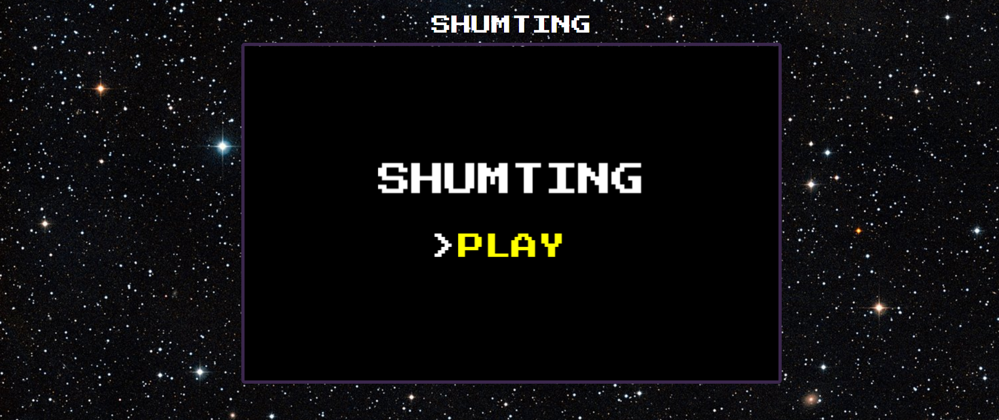

# SHUMTING
A small JS game, made with the framework PHASER-3

# 

This is my second personal project, made this little game in JS using PHASER-3, may be simple, but I hope you like it :eyes:

## FEATURES

### Tree types of enemies:

* Enemy 1:

 imagen
 
 This enemy will shoot a mini bullet to the current position of the player.
*
* Enemy 2:

  This enemy shoot between one and three bullets.
*
* Enemy 3:

  This enemy will follow the player by ten seconds and if it collide with him, it will explode.
