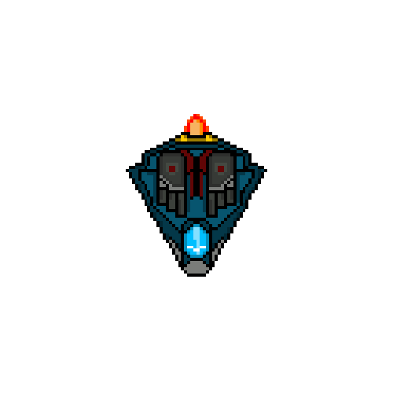

# SHUMTING
A small JS game, made with the framework PHASER-3

# 

This is my second personal project, made this little game in JS using PHASER-3, may be simple, but I hope you like it :eyes:

## FEATURES

### Tree types of enemies:

* Enemy 1:

 This enemy will shoot a mini bullet to the current position of the player.
 
 

  

##
* Enemy 2:

  This enemy shoot between one and three bullets.
##
* Enemy 3:

  This enemy will follow the player by ten seconds and if it collide with him, it will explode.
  
##

### Power ups:

* Life:

  imagen 
  
  Increase the life of the player by ten.
  
* Shield:

   imagen 
   
   Create a shield around the player.
   
* Double point:

   imagen 
   
   Each type of enemy point by two.
   
 ##
 
 ### Pause scene:
  
   The option to the player to resume or exit the game
   
   

### Game over scene:

   Shows to the player the quantity of each type of enemy defeated
   
   
